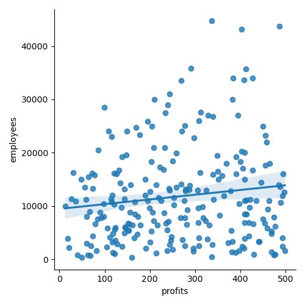
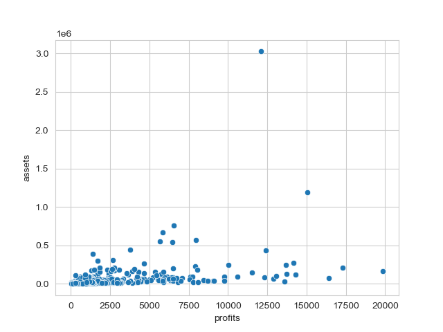
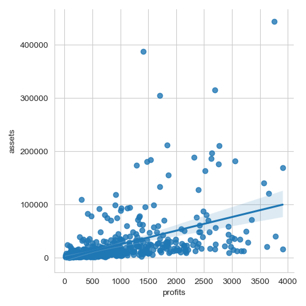

    # Introduction: 

The top Fortune 1000 firms' revenue, market value, assets, profit percentage change, employees, ranking change, and revenue percentage change for the year 2022 are all included in this dataset. All of these numbers are publicly available. On Kaggle, this specific dataset was discovered. Our dataset aims to provide a deeper understanding of the financial markets by analysing the most successful businesses worldwide. Public corporations that are listed on the US stock exchange are required to provide the government with their financial reports, which is how our data is gathered. The Fortune magazine compiled and reported on this information. By analysing this dataset, we can further understand the relationships between the amount of money a company makes compared to other variables present that may alter this. Interpreting and understanding these relationships can be key while predicting stocks.

# Exploratory Data Analysis: 

From here, we could observe that the ones that were more correlated between each other were **'rank'**, **'revenues'**, **'profits'**, **'assets'**, **'market value'**, and **'employees'**. **'Revenue percent change'** and **'change in rank'** also seemed to be highly related; and **'rank'** had a negative correlation with the other variables dure to the fact that  it is supposed to decrease while the value of the company increases, as well as its revenues.

- The highest correlation is presented between 'Revenue Percent Change' and 'Change in Rank', with a value of 0.88. This indicates if a company is going to go lower or higher in the ranking, and is useful to make predictions of the future. It makes sense because those are two of the main variables in the dataset that are related to time. Besides, the value that  most closely relates to the rank position of a company in the rank is the revenue.

- The second highest correlation, we can find it between 'Profits' and 'market value', and this translates in the profit being one of the strongest measures of how the company will be valued in the stock market.

- 'revenues' and 'employees' have the third best correlation. The number of workers in the company seems to be closer to the revenue than even the profits.

Exploring all of these relationships with charts is a better way to understand them.

# Question 1 + Results:
 What is the relationship between the number of employees and the profits/revenue of a company.

Here in the data is very sparse and a few outliers are pulling the data too far to see any visual relationships.

Here, we can observe that there is a minor increase in the number of employees as revenue rises. The relationship between revenue and employee count appears to be relatively weak. By eliminating some of the businesses with more than 50,000 employees, we can examine the situation more closely.

Here, we can see that there seems to be a very weak relationship between the revenue and the number of employees. On average, it can be seen that as revenue increases, the number of employees also steadily increases. However, the relationship doesn't seem to be very strong as there are many companies that have a low number of employees with high revenues. This would make sense, as there are industries like the tech industry that can generate large amounts of revenue with a very small team. On the flip side, there are companies like Walmart that also generate large amounts of revenue but need giant teams of people working in different places. Thus, in the revenue range of 5,000 to 25,000, we can say there is a slightly positive correlation between revenue and the number of employees.

Here, we can observe that the relationship only deteriorates as the revenue increases extremely slowly with the number of employees. A positive association can be detected, though. For many businesses, this would make sense because increased income entails more work, which necessitates hiring more staff.

### Now lets look at Employees and Profit

Here we can see that there is a correlation between profits and the number of employees. However much like revenue, there seems to be a very week correlation. Additonally, there are many companies that have less than 4000 in profits but have large number of employees we can look deeper into this range.

Here, we can see that there is a significant stagnation in the correlation between profits and labour force. Similar to the last graph, there is a very weak association between profitability and the number of employees. Many of the businesses with lesser earnings appear to have a large workforce. As a result, we are unable to draw any conclusions on the relationship between profitability and the workforce size.

In conclusion, the number of employees and the revenue seem to have a weak positive correlation. A large revenue usually indicates a larger number of employees. In the revenue ranges of 5000 to 25000 there is a slight correlation. However, in the range of 2000 to 10000 this correlation decreases substantially. This is most likely due to the different industries that many of the companies are in. Companies that are brick and motar would require many more employees than something like a software company.

When it comes to profits, the relationship is even weaker. This would make sense, as profits will be cut due to payments needed for employees. However, there is a very slight positive correlation in the profit ranges of 2000–14,000. However, as the profit ranges decrease, the correlation seems to be nonexistent, being only slightly positive. Thus, when it comes to employees and profits, no substantial relationship can be observed.

# Question 2 + Results: Which is the best company to invest in, based on its profit margin and price to earnings ratio?

There are two important variables we needed to calculate in order to answer this questions:

**Price to earnings ratio** (P/E ratio) is the quotient between the market value and the profits. It represents the expectations that the investors have for the growth of a company; so, a higher P/E ratio means higher expectations. Also, it is a good measure of how long will it take for the investment will be recovered completely, so the P/E ratio should stay in a range between 20 and 25, approximately.

**Profit margin** is also a relevant value when deciding in which stock we want to invest. It is found by dividing the annual profits over the revenues. In simple words, it tells us how many cents of profit a company keeps for every dollar it spends.

First, I took a look at revenue percent change against the change in rank. 

These two variables appear to have an almost linear relationship, a useful thing to get from here is that, to make predictions of which companies are going to have higer or lower ranks in the futre, we might want to take a look at this chart. However, the maximum density of the values are placed between a range of -20 to 75% of change in revenues, and just big companies made it outside that range.

Looking at this chart, we can see that correlation factor was not an accurate measure for the relationship between these variables, because rather than having a high linear relationship, they seem to be logarithmically correlated.

Although profits and market value appeared to be highly related, sometimes the correlation factor is not too accurate. We can see that most of the companies stay below 20,000 of profit, and the relationship is hard to see

A good P/E rato in average stands between 20 and 25, while a good profit margin should oscilate between 0.3 and 0.4

By browsing in our data, we can find those companies that have the best relation between these two variables:

- McDDonald's
- CSX
- Activision Blizzard
- Digital reality Trust
- American Water Works
- Signature Bank

### Conclussion:

When talking about investments, one has to think of the movements that fit better for each person and each budget, and of course, there are more than two parameters that determine which will be the best company for someone to invest on. However, this is a useful guide which could be developed with the basic information provided in this dataset.

From this project, and the whole course learnings, I keep subtantial useful knowledge such as Python programming, the use of Pandas and Seaborn libraries for data analysis and visualization, but most importantly, critical thinking that allows me to analyze which information is useful or not, and which is correctly or misinterpreted.

# Question 3 + Results: What is the relationship that assets has on profits

In this graph we can see a very generic representation of how profits on the x-axis impacts the assets of a company. We can see a cluster of data points in the bottom left corner and many outliers after the 20 000 mark. This does not give us an accurate idea of how the relationship between these two variables is established. 

In this graph, we reduced the maximum profits to 20 000 which will give us a closer look at the data points that were clustered together in the previous graph. If we disregard the couple of outliers, we can see that there is not a very discrete relationship between assets and profits in this graph. As the profits increase towards the maximum value of 20 000, most of the assets stay below 0.5x10^6. We now have a better idea of how this relationship exists, but it can be further examined by reducing the maximum value on the x-axis. 

When we reduce the maximum profits to 10 000, it gives us the most precise look at the relationship between these two variables. We can see from the graph that the data points are scattered throughout the graph, however one definite conclusion we can draw is that low profits will also result in low assets. This can be seen visually in the initial data points that start off at 0 for both assets and profits. In terms of the relationship between the two there is no definite linear relationship, as we can see that most of the data points hover around the 100000 and 200000 mark even a profits go all the way to 10 000. There are some data points however that exponentially increase as we go about increasing profits, and these points are considered to be outliers. 

Now that we have reduced profits even more to 4000, we can now see a very slight linear relationship between the two variables as generalized by the line of best fit. A general trend that can be noticed in all of the plots is that profits and assets do not equate to each other, as it is very much possible to have lower profits with much larger assets. This can be useful for companies to realize the trend between these two variables to make decisions in the future. 

Summary/Conclusion:

The first thing that we learned from this project is that the relationship between profits and the number of employees doesn't seem to hold. Additionally, with profit, we expected to see a decline in the number of employees. However, this was also not the case, as no relationship was seen between profit and the number of employees. This indicates that these two variables have no perceptible impact on the monetary values of the companies.

We learned that relationship between assets and profits is not exactly a linear relationship. From the graphs we can see that having high assets will not necessarily correlate to having high profits. This does not align with the initial prediction that having high assets will in turn mean that there will be higher profits. 

